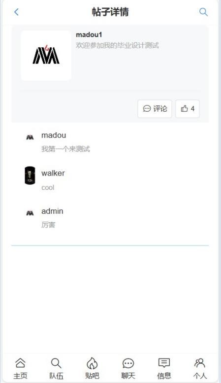
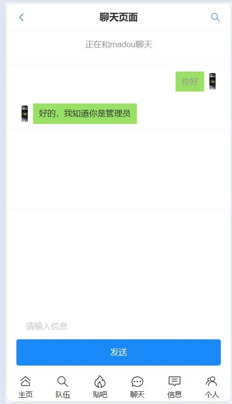
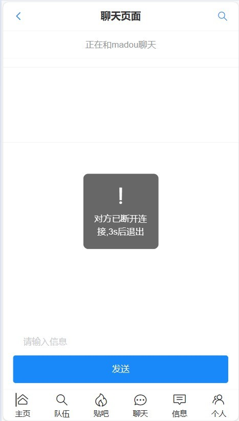

# 前言
***
校园匹配项目的后端源码，主要是用于在学校中难以寻找到与自己志气相投的同学。

后端功能主要分为，用户管理功能，队伍功能，帖子功能，聊天功能，信息通知功能。

前端源码已经开源Ice-front 前端界面，[前端源码项目](https://github.com/xiaoleng-ros/icepao-frontend)

## 技术栈
***
Spring Boot + Mybatis(Plus) + MySQL + Redis + WebSocket + Swagger

## 项目前后端部署
***

## 本地部署
## 前端部署方式
1. 代码仓库 https://github.com/xiaoleng-ros/icepao-frontend
2. 初始化项目，下载依赖
```
npm install
```
3. 全局搜索

本地部署将其中的127.0.0.1要和前端的访问地址一致，如果前端访问地址为localhost
请将127.0.0.1设置为localhost，后面地址为部署上线的地址，打包之后会根据
isDev判断是的本地环境还是线上环境而使用不同请求地址。


4. 在package.json文件中使用 dev 启动

## 后端部署
1. 代码仓库 https://github.com/xiaoleng-ros/icepao-backend
2. 本地数据库部署运行sql文件
3. 修改配置文件dev中的相关配置
## 安装redis
1. Redis配置(需要本地部署Redis)
```
  session:
    timeout: 86400
  redis:
    port: 6379
    host: localhost
    database: 1
    password: xxxx(请自行配置，没有的话可以不配置)
```
2. 配置文件中头像和图片上传地址为腾讯云COS(可以自己使用其他储存方式)
```
# 腾讯云对象储存
cos:
  client:
    accessKey: xxxxxxxxxxxxxxx    # 腾讯云 SecretId
    secretKey: xxxxxxxxxxxxxxx    # 腾讯云 SecretKey
    region: xxxxx  # 腾讯云 COS 所在区域
    bucket: xxxxx  # 腾讯云 COS Bucket 名称
file:
  cos:
    host: xxxxxxxxxx

```

# 服务器部署
1. 使用服务器配置为1核2G
2. 宝塔面板

## 前端部署

1. 需要将plugins文件下的myAxios.ts中服务器地址修改为线上后端地址
```
const myAxios = axios.create({
    baseURL: isDev ? 'http://localhost:9091/api':'http://服务器地址/api'
});
```
2. package.json文件中运行build命令，打包成dist文件夹
3. 宝塔使用PHP项目启动前端项目，并修改nginx配置(否则会出现找不到页面404)
```
 location / {
        try_files $uri $uri/ @router;#需要指向下面的@router否则会出现vue的路由在nginx中刷新出现404
        index  index.html index.htm;
     }
      #对应上面的@router，主要原因是路由的路径资源并不是一个真实的路径，所以无法找到具体的文件
      #因此需要rewrite到index.html中，然后交给路由在处理请求资源
     location @router {
         rewrite ^.*$ /index.html last;
     }
```

端口号 5173
## 后端部署

### 服务器安装redis
1. 使用宝塔面板直接安装redis
2. 配置redis https://blog.csdn.net/SpongeBob_shouse/article/details/128909794
   （来自星球某位同学的分享）
3. 配置完记得重新启动redis

### 后端项目打包
1. Redis配置(需要本地部署Redis)
```
  session:
    timeout: 86400
  redis:
    port: 6379
    host: 服务器地址
    database: 1
    password: xxxx(请自行配置，没有的话可以不配置)
```
2. 在RedissonConfig文件中配置redis配置
```
        String redisAddress = String.format("redis://%s:%s", host, port);
        config.useSingleServer().setAddress(redisAddress).setDatabase(3).setPassword(password);
```
3. 数据库地址配置
```
  datasource:
    driver-class-name: com.mysql.cj.jdbc.Driver
    url: jdbc:mysql://服务器/gebase
    username: xxxxxx
    password: xxxxxx
```
4. session配置
```
server:
  port: 9091
  servlet:
    context-path: /api
    session:
      cookie:
        domain: 服务器地址 #线下环境 域名的访问范围
```

6. package打包，将打包好的jar文件上传服务器

7. 使用宝塔的java项目运行该jar文件


## 伙伴校园的前端源码
***
Ice-front 后台系统，[前端源码项目](https://github.com/xiaoleng-ros/icepao-frontend)

## 说明
***
>如果对您有帮助，您可以右上角点一个“start”支持一下，👍
>
> 如有问题请直接在 Issues 中提，或者您发现问题并有非常好的解决方案，欢迎 PR 👍

# 效果展示
***
 
 
 
 
 
 

## 目标功能
***
+ [x] 登录注册功能
+ [X] 推荐用户功能（心动模式）
+ [X] 队伍功能
+ [x] 创建加入队伍
+ [x] 查看队伍信息
+ [x] 帖子功能
+ [x] 添加删除帖子
+ [x] 评论帖子
+ [x] 在线单聊功能
+ [x] 个人信息修改功能
+ [x] 上传头像
+ [x] 根据标签搜索用户
+ [x] 给帖子点赞功能
+ [ ] 聊天信息的记录
~~给开发者打钱的支付功能~~


# 1.0版本
***
1. 完善了帖子模块，完成对帖子发布，帖子评论，点赞功能，并对帖子数据做缓存，提高查询速度。
2. 新增了信息通知功能，对帖子中的评论和点赞会推送信息给帖子的创建者。
3. 对用户模块，队伍模块，帖子模块都做了数据缓存，并使用Redisson锁保证事务的安全性。

+ [x] Redis对数据缓存
+ [x] 用分布式锁对事务做原子性操作
+ [x] 信息通知功能
+ [ ] 完善聊天功能
+ [ ] 优化用户推荐算法

